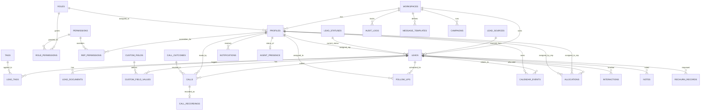

# 01 — Database Architecture & ERD Proposal

This is a **proposal** for Phase 2 review — no migrations are created yet. Every table below was evaluated against: entity necessity, relationships, ownership, workspace boundary, indexing, RLS, audit, and realtime needs (per master plan §6).

## 1. Multi-Tenancy Rule

Every tenant-owned table has a non-null `workspace_id uuid references workspaces(id)`. RLS policy pattern on every such table:

```sql
using (workspace_id = (select workspace_id from profiles where id = auth.uid()))
```

Global/system tables (`roles` when `is_system = true`, `permissions`) have no `workspace_id` and are readable by all authenticated users.

## 2. Entity List & Purpose

| Table | Purpose | Workspace-scoped |
|---|---|---|
| `workspaces` | Tenant/company root | n/a (root) |
| `profiles` | App-level user record, 1:1 with `auth.users` | ✅ |
| `roles` | team_mate / manager / admin / ceo (+ custom) | ✅ (nullable for system roles) |
| `permissions` | Fixed catalogue of permission codes | ❌ (global) |
| `role_permissions` | Role → permission grants | via role |
| `rep_permissions` | Per-user permission overrides (grant/revoke) | ✅ |
| `lead_sources` | Configurable lead origin list | ✅ |
| `lead_statuses` | Configurable pipeline stages, ordered | ✅ |
| `tags` | Reusable label catalogue | ✅ |
| `leads` | Core lead/prospect record (becomes customer via flag) | ✅ |
| `lead_tags` | Lead ↔ tag join | via lead |
| `lead_documents` | File metadata for a lead (Storage holds bytes) | ✅ |
| `custom_fields` | Tenant-defined field definitions (lead/customer) | ✅ |
| `custom_field_values` | Values for custom fields (EAV) | ✅ |
| `call_outcomes` | Configurable outcome catalogue | ✅ |
| `calls` | Call attempts/records + state machine result | ✅ |
| `call_recordings` | Recording metadata, one per call, status-tracked | ✅ |
| `follow_ups` | Scheduled follow-up actions | ✅ |
| `calendar_events` | Meetings/appointments/tasks (follow-ups may project here) | ✅ |
| `allocations` | Lead assignment lifecycle (new/pending/actioned) | ✅ |
| `interactions` | Unified timeline event log for Customer 360 | ✅ |
| `notes` | Free-text notes on a lead | ✅ |
| `notifications` | Per-user notification inbox | ✅ |
| `campaigns` | Outbound messaging campaign metadata | ✅ |
| `message_templates` | Reusable message templates w/ variables | ✅ |
| `rechurn_records` | Leads queued for re-engagement | ✅ |
| `audit_logs` | Before/after mutation trail for sensitive tables | ✅ |
| `agent_presence` | Live rep status (available/on_call/offline) | ✅ |

`customers` is **not** a separate table: a `leads` row with `is_customer = true` (set at conversion) *is* the customer. This avoids duplicating contact/timeline data across two tables, matching "do not create tables unnecessarily." Customer-only fields (if any emerge, e.g. account value) go in `custom_field_values` or a thin `customer_details` extension table added only if a real need appears in Phase 7/8.

## 3. Core Relationships (ERD)



## 4. Key Field Notes (not final DDL — locked in Phase 2)

- `leads.status_id`, `leads.priority`, `leads.assigned_to`, `leads.is_customer`, `leads.converted_at` drive the pipeline and Customer 360 split.
- `calls.state` enum mirrors the calling state machine (§ calling architecture doc): `IDLE, DIALING, RINGING, CONNECTED, ENDED, FAILED, MISSED, CANCELLED`.
- `call_recordings.status` enum: `supported, unsupported, permission_denied, failed, unavailable, processing, ready` — recording is never a blocker for `calls` row creation.
- `follow_ups.status`: `pending, completed, overdue (derived), cancelled`.
- `allocations.status`: `new, pending, actioned`.
- `interactions.type`: `call, note, status_change, document, follow_up, message, allocation` — one append-only table backs the Customer 360 timeline instead of UNION-ing five tables at read time.
- `audit_logs` captures mutations on: `leads`, `calls`, `allocations`, `follow_ups`, `rep_permissions`, `role assignments` — not every table (avoid unnecessary volume).

## 5. Indexing Plan (representative, finalized in Phase 2 migration)

- Every `workspace_id` column: btree index (RLS filters on it constantly).
- `leads`: composite `(workspace_id, status_id)`, `(workspace_id, assigned_to)`, `(workspace_id, created_at desc)`, trigram/GIN index on `name`/`phone` for search.
- `calls`: `(workspace_id, lead_id, started_at desc)`, `(workspace_id, agent_id, started_at desc)`.
- `follow_ups`: `(workspace_id, assigned_to, due_at)` for today/overdue queries.
- `notifications`: `(workspace_id, user_id, is_read, created_at desc)`.
- `interactions`: `(workspace_id, lead_id, created_at desc)`.

## 6. RLS Requirements Summary

1. Every workspace-scoped table: `select/insert/update/delete` gated on `workspace_id` match.
2. `leads`/`calls`/`follow_ups`: additionally gated so a `team_mate` sees only rows where they're `assigned_to`/`agent_id`, unless role is `manager`/`admin`/`ceo` (full-workspace visibility) — enforced via a `has_permission()` / `is_manager_or_above()` SQL function, not duplicated inline per policy.
3. `lead_documents`/Storage: signed URLs scoped per workspace bucket path (`{workspace_id}/{lead_id}/...`); RLS on the metadata table plus Storage policy on the path prefix.
4. `audit_logs`: insert-only from server-side (service role / trigger), never client-writable; read restricted to `admin`/`ceo`.
5. `roles`/`permissions`: read-only to all authenticated users in-workspace; write restricted to `admin`/`ceo` (and system roles are immutable).

## 7. Realtime Requirements Summary

Subscribe selectively, not to every table:
- `leads` (workspace + assigned-to filtered) — for allocation/status live updates.
- `follow_ups` — reminders/overdue live updates.
- `notifications` — inbox badge.
- `agent_presence` — team screen.
- `calls` — only when a manager is viewing a live team-activity view (not default-on for every rep).

## 8. Audit Requirements Summary

Trigger-based `audit_logs` writes on: lead status/assignment changes, permission/role changes, document deletes, allocation reassignment. Implemented as Postgres triggers in Phase 2, not application-level, so it can't be bypassed by direct DB access.

## 9. Open Questions for Phase 2 Kickoff

- Final choice: Celery/Redis vs. `arq` vs. Supabase cron + Edge Functions for background jobs (affects whether `DATABASE_URL` direct access is needed alongside `supabase-py`).
- Whether `calendar_events` is materialized separately from `follow_ups` or `follow_ups` project into it read-only (leaning: separate table, follow-ups can optionally spawn a calendar event).
- Custom field type catalogue (text/number/date/select/multiselect) — confirm before Phase 2 DDL.
