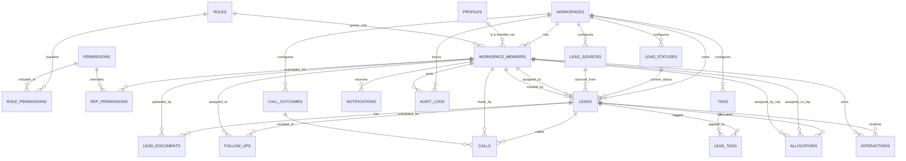

# Database ERD — Phase 2

See `database.md` for the reasoning behind every decision reflected here.

## Notes on Reading This ERD

- `PROFILES` connects to the rest of the schema **only** through `WORKSPACE_MEMBERS` — there is no direct `PROFILES ||--o{ LEADS` or similar edge, by design (`database.md` §2–3).
- Every edge from `WORKSPACE_MEMBERS` outward (to `LEADS`, `CALLS`, `FOLLOW_UPS`, `ALLOCATIONS`, `INTERACTIONS`, `NOTIFICATIONS`) is backed by a composite `(workspace_id, id)` foreign key, not shown as a separate edge here for readability — see `database.md` §3.
- `CUSTOMERS` does not appear — a `LEADS` row with `is_customer = true` *is* the customer (`database.md` §4).
- `NOTES` does not appear — a `note`-typed `INTERACTIONS` row *is* a note (`database.md` §5).
